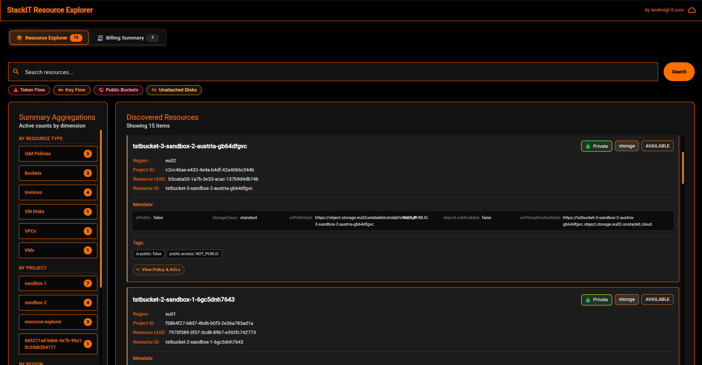
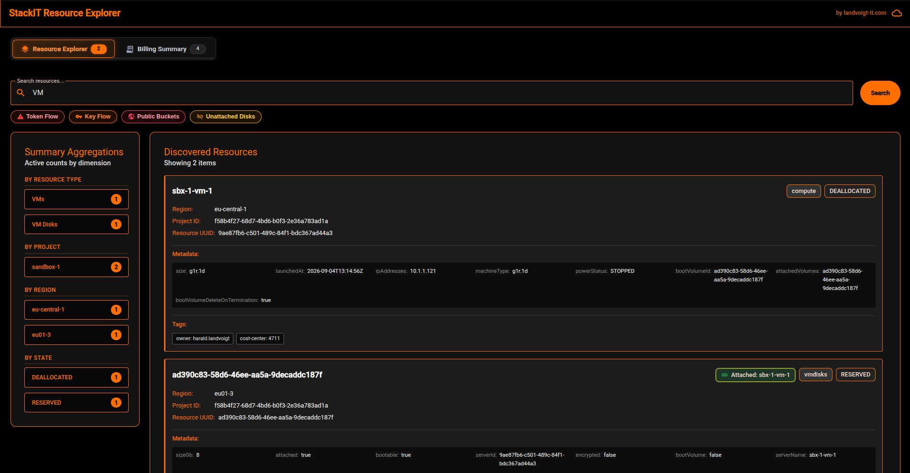
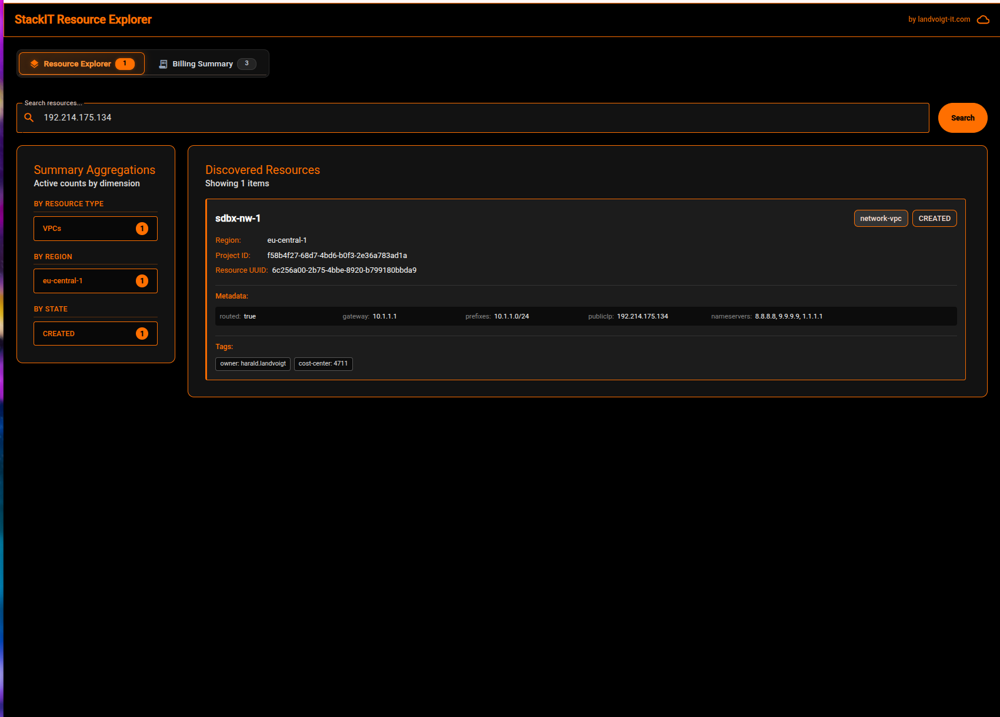

# STACKIT Resource Explorer

A comprehensive resource discovery, cataloging, querying, and visual exploration platform designed for the **STACKIT** cloud hyperscaler.

The application consists of a high-performance **Quarkus (Java 21)** backend, an **Angular (Angular Material M3)** frontend with a modern black-and-orange theme, and a **PostgreSQL** relational database.

> [!WARNING]
> **Early Project Status**: This project is in active, early-stage development. APIs, data schemas, and UI components may evolve rapidly. Feedback, issues, and contributions are welcome!

---

## UI Preview

### 1. Unified Cloud Dashboard & Multi-Dimensional Aggregations


### 2. Live Full-Text Search & Real-Time Filtering


### 3. Deep Metadata & IP Address Search


## Architecture Overview

```
                          ┌───────────────────────────┐
                          │  Angular Web Application  │
                          │   (Port 8081 via Nginx)   │
                          └─────────────┬─────────────┘
                                        │ /resources
                                        ▼
                          ┌───────────────────────────┐
                          │   Quarkus Backend (JVM)   │
                          │        (Port 8080)        │
                          └───────┬───────────┬───────┘
                                  │           │
                 Scrapes Cloud    │           │ Persists / Queries
                                  ▼           ▼
                     ┌──────────────────┐  ┌──────────────────────┐
                     │   STACKIT APIs   │  │ PostgreSQL Database  │
                     │  - Resource Mgr  │  │     (Port 5432)      │
                     │  - IaaS (VM/VPC) │  └──────────────────────┘
                     │  - Block Storage │
                     │  - Load Balancer │
                     │  - ObjectStorage │
                     │  - IAM / SA      │
                     │  - Cost API v3   │
                     └──────────────────┘
```

---

## Core Capabilities

- **Automatic Multi-Project Discovery**: Automatically discovers the parent organization and recursively traverses the entire folder hierarchy to crawl all nested projects using the STACKIT Resource Manager API.
- **Compute Scraper (Virtual Machines)**:
  - Scrapes VM instances across all discovered projects via the STACKIT IaaS API (`/v1/projects/{projectId}/servers`).
  - Captures rich metadata: Availability Zone (mapped into region), power status (`RUNNING`, `SHUTOFF`), machine type/size, boot volume ID & termination policy, attached volume IDs, security groups, SSH keypair names, and IPv4/public IP addresses.
  - Automatically parses server labels and maps them to resource tags.
- **Storage Scrapers**:
  - **Object Storage**: Catalogs buckets, regions, and configuration across projects. Gracefully handles inactive services (`404`) and permission boundaries (`403`).
  - **VM Disks (Block Storage)**: Catalogs persistent block storage volumes (`/v1/projects/{projectId}/volumes`), capturing volume size, status, performance class, source, and attached server IDs.
- **Network Scrapers**:
  - **Virtual Private Clouds (VPC)**: Catalogs network VPC topologies (`/v1/projects/{projectId}/networks`), capturing prefixes, gateway routing, and labels.
  - **Load Balancers**: Catalogs application load balancers, listeners, and target pools via the STACKIT Load Balancer API.
- **IAM & Authentication Scraper**: Recursively catalogs identities, permissions, and authentication flows across all discovered projects:
  - **Members (Access Control)**: Project-level role bindings for users, groups, and service accounts via the STACKIT Authorization API (`/v2/project/{projectId}/members`). Correlates project members to service accounts to inherit authentication scheme metadata.
  - **Service Accounts (Defined Identities)**: Service accounts defined within each project via the STACKIT Service Account API (`/v2/projects/{projectId}/service-accounts`).
  - **Authentication Scheme & Deprecation Detection**:
    - Distinguishes modern asymmetric RSA/ECDSA key pairs (`Key Flow (RSA_2048)`), human SSO (`OIDC / Enterprise SSO`), and platform-managed identities.
    - Detects and tags legacy static API secrets (`Token Flow (Deprecated)` - *"The legacy model where a long-lived, static API secret acted directly as a bearer token."*), exposing active token counts and expiration dates.
- **Cost & Consumption Scraper**: Periodically queries the **STACKIT Cost API v3** (`https://cost.api.stackit.cloud/v3/costs/{customerAccountId}`) for the current calendar month in UTC:
  - Catalogs expenses for each project (`billing`) and computes the aggregate organization total (`billing-org`).
  - Automatically converts amounts from cents to EUR.
  - Features an on-demand fallback: when the `/resources/billing-summary` endpoint is queried, if no records exist in cache yet, it triggers an immediate scrape.
- **Interactive UI Dashboard**:
  - **Authentication Quick Filters & Deprecation Badges**: 1-click quick-filter buttons located below the search bar:
    - **Token Flow (Red)**: Filters service accounts and users utilizing deprecated static API tokens (`"Token Flow"`).
    - **Key Flow (Orange)**: Filters service accounts utilizing modern asymmetric RSA key pairs (`"Key Flow"`).
    - Prominent warning chips on resource cards utilizing deprecated static token credentials (searchable anytime via `"Token Flow"`).
  - **Resource Explorer**: Search and filter discovered resources in real time via PostgreSQL Full-Text Search. Returns results capped at 100 elements for ultra-fast rendering while displaying a `"Showing X of Y items"` indicator.
  - **Resource Details & UUIDs**: Displays the exact **Resource UUID** alongside any distinct human-readable **Resource ID** (such as bucket names or IAM accounts). Cleanly formats complex metadata (arrays of IPs or volumes) and excludes blank fields.
  - **Multi-Dimensional Summary Aggregations**: Backend-calculated exact counts stacked across three distinct dimensions:
    - **By Resource Type** (*VMs*, *Buckets*, *Invoices*, *Networks*, *IAM Policies*)
    - **By Region** (e.g. *eu01*, *eu01-1*, *eu01-3*, *global*)
    - **By State** (e.g. *ACTIVE*, *RUNNING*, *AVAILABLE*, and *DELETED* with warning accents)
  - **Billing Summary**: Aggregated project and organization consumption for the current calendar month in UTC with currency conversions. The Organization total is pinned to the first row, followed by projects ordered descending by costs.
- **Production-Ready Persistence & Flyway Migrations**:
  - Schema lifecycle and GIN full-text index managed via versioned Flyway migrations (`V1.0.0__init_schema_and_fts_gin_index.sql`).
  - Hibernate ORM runs in `validate` mode to safeguard against schema drift.

---

## Scraper Service Account Prerequisites & IAM Permissions

To crawl projects, services, and billing across an organization or project hierarchy, the scraper service account key (`scraper.json`) requires appropriate STACKIT IAM permissions.

### Recommended Roles
* **Organization / Folder Level**:
  * `project.auditor` or `reader` / `viewer` across the organization or folder tree.
* **Per-Service Roles (if using granular permissions)**:

| Service Domain | Recommended Role | Required Permissions / Capabilities |
| :--- | :--- | :--- |
| **Resource Manager** | `resourcemanager.organization.viewer`, `resourcemanager.project.viewer` | Discovery of folders and child projects |
| **Compute (VMs)** | `iaas.viewer` or `iaas.admin` | `iaas.server.read` to list servers |
| **VM Disks (Storage)** | `iaas.viewer` or `iaas.admin` | `iaas.volume.read` to list block storage volumes |
| **Network VPC** | `iaas.viewer` or `iaas.admin` | `iaas.network.read` to list VPC networks |
| **Load Balancers** | `loadbalancer.auditor` or `loadbalancer.viewer` | `loadbalancer.loadbalancer.read` |
| **Object Storage** | `objectstorage.auditor` or `objectstorage.viewer` | `objectstorage.bucket.read` |
| **IAM Members** | `authorization.auditor` | `authorization.member.read` |
| **Service Accounts & Credentials** | `service-account.viewer` or `service-account.auditor` | `serviceaccount.serviceaccount.read`, `serviceaccount.token.read`, `serviceaccount.key.read` |
| **Billing / Cost** | `cost.viewer` or `billing.viewer` | Read access to STACKIT Cost API v3 |

> **Note**: If a service is not enabled for a project or the service account lacks access to a specific project, the scrapers log a non-fatal warning (`403 Forbidden` / `404 Not Found`) and continue processing remaining projects.

---

## Quickstart with Docker Compose

### Option A: Run Pre-built Images from GitHub Container Registry (Recommended)

You can run the entire stack without cloning the repository or installing build dependencies:

1. **Download the Docker Compose file**:
   ```bash
   curl -sSL -O https://raw.githubusercontent.com/harald-landvoigt/stackit-resource-explorer/main/docker/docker-compose.yml
   ```

2. **Provide your STACKIT Service Account Key**:
   Place your service account key as `scraper.json` in the same directory:
   ```bash
   cp /path/to/your/sa-key.json ./scraper.json
   ```

3. **Start the containers**:
   ```bash
   docker compose up -d
   ```
   Docker will automatically pull the pre-built images from GHCR:
   - Backend: `ghcr.io/harald-landvoigt/stackit-resource-explorer/backend:latest`
   - Frontend: `ghcr.io/harald-landvoigt/stackit-resource-explorer/frontend:latest`
   - Database: `postgres:15-alpine`

---

### Option B: Build & Run from Source (Local Development)

If you have cloned the repository and wish to build containers locally from source:

1. Place your STACKIT service account key in `.keys/scraper.json` in the root of the repository.
2. Run Docker Compose with the build step:
   ```bash
   cd docker
   docker compose up -d --build
   ```
   *(Docker Compose automatically merges `docker-compose.override.yml` to build backend and frontend images from local source).*

3. Alternatively, build the backend image directly with **Quarkus Jib**:
   ```bash
   cd ../backend
   ./mvnw package -DskipTests -Dquarkus.container-image.build=true
   ```

### Services & Port Mappings

| Service | Port | Description |
| :--- | :--- | :--- |
| **Frontend** | `8081` | Angular Web Dashboard & Nginx reverse proxy |
| **Backend** | `8080` | Quarkus REST API & Scheduled Scraper Engine |
| **Database** | `5432` | PostgreSQL persistence store |

---

## Configuration & Environment Variables

The backend can be configured via `application.properties` or overridden with environment variables:

| Property | Environment Variable | Default | Description |
| :--- | :--- | :--- | :--- |
| `stackit.sdk.service-account-key-path` | `STACKIT_SERVICE_ACCOUNT_KEY_PATH` | `/app/keys/scraper.json` | Path to service account credentials JSON |
| `stackit.compute.schedule` | `STACKIT_COMPUTE_SCHEDULE` | `1h` | Schedule for Compute VM Scraper (`1h`, cron, or `off`) |
| `stackit.storage.schedule` | `STACKIT_STORAGE_SCHEDULE` | `1h` | Schedule for Object Storage Scraper |
| `stackit.vmdisks.schedule` | `STACKIT_VMDISKS_SCHEDULE` | `1h` | Schedule for VM Disk (Block Storage) Scraper |
| `stackit.network.schedule` | `STACKIT_NETWORK_SCHEDULE` | `1h` | Schedule for Load Balancer Scraper |
| `stackit.network-vpc.schedule` | `STACKIT_NETWORK_VPC_SCHEDULE` | `1h` | Schedule for Network VPC Scraper |
| `stackit.iam.schedule` | `STACKIT_IAM_SCHEDULE` | `1h` | Schedule for IAM Scraper |
| `stackit.billing.schedule` | `STACKIT_BILLING_SCHEDULE` | `1h` | Schedule for Cost & Billing Scraper |

---

## REST API Endpoints

- `GET /resources?q={query}`: Retrieves resources and exact aggregations matching the search query. Capped at a maximum of 100 resource items for performance, returning a complete aggregation envelope:
  ```json
  {
    "resources": [
      {
        "id": "9ae87fb6-c501-489c-84f1-bdc367ad44a3",
        "resourceId": "9ae87fb6-c501-489c-84f1-bdc367ad44a3",
        "name": "sbx-1-vm-1",
        "type": "compute",
        "status": "ACTIVE",
        "region": "eu01-3",
        "projectId": "f58b4f27-68d7-4bd6-b0f3-2e36a783ad1a",
        "tags": {
          "cost-center": "4711",
          "owner": "harald.landvoigt"
        },
        "data": {
          "machineType": "g1r.1d",
          "powerStatus": "RUNNING",
          "availabilityZone": "eu01-3",
          "bootVolumeId": "ad390c83-58d6-46ee-aa5a-9decaddc187f",
          "attachedVolumes": ["ad390c83-58d6-46ee-aa5a-9decaddc187f"],
          "ipAddresses": ["192.168.1.10", "193.148.160.5"]
        }
      }
    ],
    "totalCount": 1450,
    "typeAggregations": [
      { "key": "VMs", "count": 850 },
      { "key": "Buckets", "count": 400 },
      { "key": "Networks", "count": 150 },
      { "key": "IAM Policies", "count": 50 }
    ],
    "regionAggregations": [
      { "key": "eu01-3", "count": 850 },
      { "key": "eu01", "count": 550 },
      { "key": "global", "count": 50 }
    ],
    "statusAggregations": [
      { "key": "ACTIVE", "count": 900 },
      { "key": "RUNNING", "count": 500 },
      { "key": "DELETED", "count": 50 }
    ]
  }
  ```
- `GET /resources/{id}`: Retrieves details for a specific resource by UUID.
- `GET /resources/billing-summary`: Returns aggregated current-month expenses grouped by project and organization in EUR. Automatically triggers an on-demand scrape if the database cache is empty.

---

## Local Development & Testing

### Backend (Quarkus / Java 21)
```bash
cd backend
./mvnw test                  # Run unit and integration test suite (59 tests)
./mvnw quarkus:dev           # Run dev mode with hot reload (Dev UI at http://localhost:8080/q/dev)
```

### Frontend (Angular 21 / Vitest)
```bash
cd frontend
npm test -- --watch=false    # Run unit tests via Vitest (31 tests)
ng serve                     # Start development server on port 4200 (proxies backend to 8080)
```
