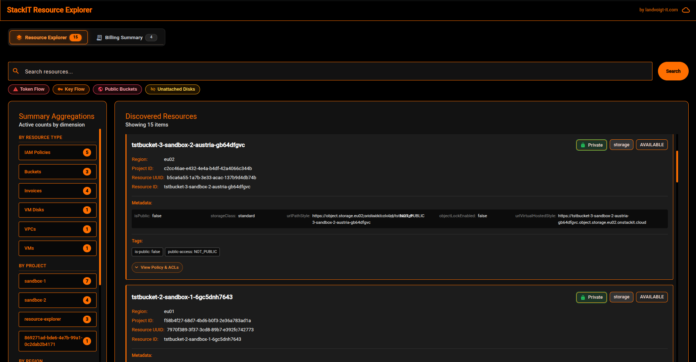
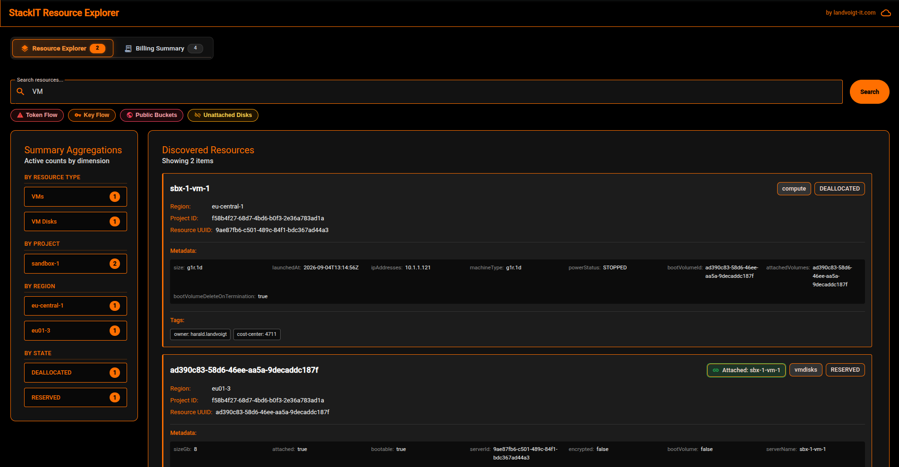
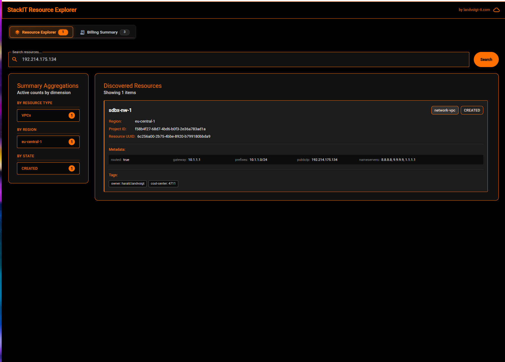

# STACKIT Resource Explorer

A comprehensive resource discovery, cataloging, querying, and visual exploration platform designed for the **STACKIT** cloud hyperscaler.

The application consists of a high-performance **Quarkus (Java 21)** backend, an **Angular (Angular Material M3)** frontend with a modern black-and-orange theme, and a **PostgreSQL** relational database.

> [!WARNING]
> **Early Project Status**: This project is in active, early-stage development. APIs, data schemas, and UI components may evolve rapidly. Feedback, issues, and contributions are welcome!

---

## UI Preview

### 1. Unified Cloud Dashboard & Multi-Dimensional Aggregations


### 2. Live Full-Text Search & Real-Time Filtering


### 3. Deep Metadata & IP Address Search


## Architecture Overview

```
                          ┌───────────────────────────┐
                          │  Angular Web Application  │
                          │   (Port 8081 via Nginx)   │
                          └─────────────┬─────────────┘
                                        │ /resources
                                        ▼
                          ┌───────────────────────────┐
                          │   Quarkus Backend (JVM)   │
                          │        (Port 8080)        │
                          └───────┬───────────┬───────┘
                                  │           │
                 Scrapes Cloud    │           │ Persists / Queries
                                  ▼           ▼
                     ┌──────────────────┐  ┌──────────────────────┐
                     │   STACKIT APIs   │  │ PostgreSQL Database  │
                     │  - Resource Mgr  │  │     (Port 5432)      │
                     │  - IaaS (VM/VPC) │  └──────────────────────┘
                     │  - Block Storage │
                     │  - Load Balancer │
                     │  - ObjectStorage │
                     │  - IAM / SA      │
                     │  - Cost API v3   │
                     └──────────────────┘
```

---

## Core Capabilities

- **Automatic Multi-Project Discovery**: Automatically discovers the parent organization and recursively traverses the entire folder hierarchy to crawl all nested projects using the STACKIT Resource Manager API.
- **Compute Scraper (Virtual Machines & Public IP Auditing)**:
  - Scrapes VM instances across all discovered projects via the STACKIT IaaS API (`/v1/projects/{projectId}/servers`).
  - Captures rich metadata: Availability Zone (mapped into region), power status (`RUNNING`, `SHUTOFF`), machine type/size, boot volume ID & termination policy, attached volume IDs, security groups, SSH keypair names, and IPv4/public IP addresses.
  - **Public IP History & Auditing**: Maintains an append-only timeline of all public IP addresses that have ever been assigned to each VM (`publicIpHistory`), preserving exact first-seen and last-seen timestamps and active/historical status badges (`[Active (since <date>)]` vs. `[Historical (<firstSeen> – <lastSeen>)]`). All historical IPs remain indexed in PostgreSQL full-text search and survive VM IP rotations and soft-deletion.
  - Automatically parses server labels and maps them to resource tags.
- **Storage Scrapers**:
  - **Object Storage & S3 Security Analysis**: Catalogs buckets and regional endpoints. Uses dynamic Just-In-Time (JIT) S3 access credentials to inspect bucket ACLs, raw bucket policy JSON, and compliance locks (Object Lock & retention periods). Evaluates public exposure risks, applying status badges: 🔴 **Public** (with exposure method), 🟢 **Private**, or 🟠 **UNKNOWN** (when ACL data is unreadable or JIT access is forbidden). Provides an expandable policy and ACL viewer in the UI.
  - **VM Disks (Block Storage & Attachment Tracking)**: Catalogs persistent block storage volumes (`/v1/projects/{projectId}/volumes`), capturing volume size, status, performance class, source, and server attachments. Cross-references active compute instances in the project to reliably detect attached servers (including deallocated/shelved servers where Cinder reports `volume.getServerId() == null`) and resolve parent server names. Accurately identifies idle/orphan volumes with `attached: false` and `attachmentStatus: "UNATTACHED"`, indexed in PostgreSQL for instant full-text discovery.
- **Network Scrapers**:
  - **Virtual Private Clouds (VPC)**: Catalogs network VPC topologies (`/v1/projects/{projectId}/networks`), capturing prefixes, gateway routing, and labels.
  - **Load Balancers**: Catalogs application load balancers, listeners, and target pools via the STACKIT Load Balancer API.
  - **Public IPs (Attached & Unattached / Floating)**: Directly catalogs standalone public IP allocations across all projects and regions via the STACKIT IaaS v2 API (`/v2/projects/{projectId}/regions/{region}/public-ips`). Accurately distinguishes attached IPs from unattached/floating IPs (`attached: true|false`, `attachmentStatus: "ATTACHED"|"UNATTACHED"`), correlates network interfaces with compute VM instances to resolve parent server IDs and server names, and identifies unattached allocations across both `eu01` and `eu02`. Soft-deleted when released in STACKIT.
- **IAM & Authentication Scraper**: Recursively catalogs identities, permissions, and authentication flows across all discovered projects:
  - **Members (Access Control)**: Project-level role bindings for users, groups, and service accounts via the STACKIT Authorization API (`/v2/project/{projectId}/members`). Correlates project members to service accounts to inherit authentication scheme metadata.
  - **Service Accounts (Defined Identities)**: Service accounts defined within each project via the STACKIT Service Account API (`/v2/projects/{projectId}/service-accounts`).
  - **S3 Access Keys & Credentials Groups**: Catalogs persistent Object Storage S3 access keys and credentials groups across all configured regions (`eu01`, `eu02`), tracking key expiration (`ACTIVE` vs. `EXPIRED`), credentials groups, and HMAC key IDs while excluding transient audit keys (`resource-explorer-audit`). Fully supports non-expiring keys ("Never expires") mapped to `expires: "Never"` and status `ACTIVE`.
  - **Authentication Scheme & Deprecation Detection**:
    - Distinguishes modern asymmetric RSA/ECDSA key pairs (`Key Flow (RSA_2048)`), human SSO (`OIDC / Enterprise SSO`), persistent S3 credentials (`S3 HMAC Key`), and platform-managed identities.
    - Detects and tags legacy static API secrets (`Token Flow (Deprecated)` - *"The legacy model where a long-lived, static API secret acted directly as a bearer token."*), exposing active token counts and expiration dates.
- **Cost & Consumption Scraper**: Periodically queries the **STACKIT Cost API v3** (`https://cost.api.stackit.cloud/v3/costs/{customerAccountId}`) for the current calendar month in UTC:
  - Catalogs expenses for each project (`billing`) and computes the aggregate organization total (`billing-org`).
  - Automatically converts amounts from cents to EUR.
  - Features an on-demand fallback: when the `/resources/billing-summary` endpoint is queried, if no records exist in cache yet, it triggers an immediate scrape.
- **Interactive UI Dashboard**:
  - **Authentication & Security Quick Filters**:
    - **Public Buckets (Rose)**: 1-click filter for publicly exposed storage buckets (`is-public: true`).
    - **Unattached Disks (Amber)**: 1-click filter for idle / orphan block storage disks (`"unattached vmdisks"`), enabling quick identification of wasted storage spend.
    - **Unattached IPs (Purple)**: 1-click filter for idle / unattached floating public IPs (`"unattached public-ip"`), instantly isolating unassigned public IP addresses.
    - **Token Flow (Red)**: Filters service accounts and users utilizing deprecated static API tokens (`"Token Flow"`).
    - **Key Flow (Orange)**: Filters service accounts utilizing modern asymmetric RSA key pairs (`"Key Flow"`).
    - **S3 Keys (Sky Blue)**: 1-click filter for Object Storage S3 access keys (`"S3 Access Key"`).
    - Prominent warning chips on resource cards utilizing deprecated static token credentials (searchable anytime via `"Token Flow"`).
  - **Resource Explorer**: Search and filter discovered resources in real time via PostgreSQL Full-Text Search. Returns results capped at 100 elements for ultra-fast rendering while displaying a `"Showing X of Y items"` indicator.
  - **Resource Details, Badges & UUIDs**:
    - Displays the exact **Resource UUID** alongside any distinct human-readable **Resource ID** (such as bucket names or IAM accounts). Cleanly formats complex metadata (arrays of IPs or volumes) and excludes blank fields.
    - **Disk Attachment Badges**: VM disks display clear color-coded badges: 🟡 **`[Unattached]`** (amber warning for idle/orphan volumes), 🟢 **`[Attached: <serverName>]`** (green badge with parent VM name), and 🔵 **`[Boot Disk]`** (blue badge for OS root volumes).
    - **Public IP Badges**: Public IPs display dedicated badges: 🟢 **`[Attached (VM: <serverName>)]`** (green badge with parent VM name) or 🟣 **`[Unattached / Floating]`** (purple badge for idle/unassigned public IPs).
    - **S3 Access Key Badges**: Persistent S3 access keys display color-coded identity chips: 🔷 **`[S3 Key: <groupName>]`** (sky-blue badge with credentials group name) and 🔴 **`[EXPIRED]`** (red warning for expired keys).
    - **Soft-Deleted Resources & Lifecycle Tracking**: Decommissioned resources retain their discovery record with `deletedAt` timestamps. Soft-deleted resources are included in both unfiltered catalog views and text searches, styled with a red `.deleted-card` accent, a distinct `DELETED` status badge (`.deleted-status`) with a `delete_outline` icon, and a `Deleted At: <timestamp>` detail row. Multi-dimensional aggregations consistently tally all active and deleted resources.
  - **Multi-Dimensional Summary Aggregations**: Backend-calculated exact counts stacked across four distinct dimensions with a responsive scrollable container (`max-height: 70vh`) and custom orange scrollbar matching the resource explorer:
    - **By Resource Type** (*VMs*, *Public IPs*, *Buckets*, *VM Disks*, *Invoices*, *Networks*, *IAM Policies*)
    - **By Project** (e.g. *resource-explorer*, *sandbox-1*, *sandbox-2*, or *Global / No Project* with automatic project ID-to-name resolution)
    - **By Region** (e.g. *eu01*, *eu01-1*, *eu01-3*, *global*)
    - **By State** (e.g. *ACTIVE*, *RUNNING*, *AVAILABLE*, and *DELETED* with warning accents)
  - **Billing Summary**: Aggregated project and organization consumption for the current calendar month in UTC with currency conversions. The Organization total is pinned to the first row, followed by projects ordered descending by costs.
  - **Access Issues View & Project Status Matrix**:
    - Automatically monitors and records scraper permission results (`ACCESSIBLE`, `ACCESS_DENIED`, `NOT_CHECKED`) across all discovered projects and services (`compute`, `storage`, `network`, `network-vpc`, `public-ip`, `vmdisks`, `iam`, `billing`) in a thread-safe registry.
    - Exposes `GET /resources/access-issues` providing a consolidated summary, project-by-service matrix, and active issues detail list.
    - Dedicated **"Access Issues"** tab with live counter badge, KPI summary cards (Total Projects Checked, Affected Projects, Total Issues), Project × Resource Type status matrix with visual status chips (🟢 `OK`, 🔴 `DENIED`, ⚪ `N/A`), and an active issues diagnostic table with error logs, HTTP status codes, and search filters.
- **Production-Ready Persistence & Flyway Migrations**:
  - Schema lifecycle and GIN full-text index managed via versioned Flyway migrations (`V1.0.0__init_schema_and_fts_gin_index.sql`, `V1.1.0__cleanup_duplicate_storage_resources.sql`).
  - Strict baseline control (`quarkus.flyway.baseline-on-migrate=false`) guarantees that initial migrations are never silently skipped on pre-existing non-empty databases.
  - Hibernate ORM runs in `validate` mode to safeguard against schema drift.
  - **Read-Only API Architecture**: Mutation endpoints (e.g. `POST /resources`) are eliminated; data ingestion is performed exclusively through internal scheduled and on-demand cloud scrapers.

---

## What's Missing / Planned Roadmap

While the Resource Explorer provides robust automated discovery and real-time search across core STACKIT infrastructure, the following architectural and enterprise capabilities are planned for upcoming releases:

- **Instance Profiles & Workload Identity (Zero Static Secrets)**:
  - Currently, the backend authenticates using a mounted service account JSON key file (`scraper.json`).
  - *Planned*: Support for STACKIT VM metadata service / instance profiles and SKE Workload Identity tokens, eliminating the need to generate, rotate, and mount static JSON key files.

- **User Authentication & Role-Based Access Control (OIDC / SSO / RBAC)**:
  - Currently, the web dashboard and REST APIs operate without authentication, intended for secure internal network deployments.
  - *Planned*: OpenID Connect (OIDC) / OAuth2 authentication integrating with STACKIT SSO or enterprise identity providers (e.g. Keycloak, Azure AD/Entra ID), with granular RBAC to scope access (e.g. restricting billing summaries or project visibility by user team).

- **Expanded STACKIT Resource Coverage**:
  - **STACKIT Kubernetes Engine (SKE)**: Clusters, node pools, Kubernetes versions, maintenance schedules, and cluster health states.
  - **Database as a Service (DaaS)**: Managed PostgreSQL, MariaDB, Redis, RabbitMQ, and OpenSearch service instances.
  - **DNS Engine**: Forward/reverse DNS zones, record sets, and routing policies.
  - **Secrets Manager**: Vault instances, active secrets status, and encryption key rotation states.
  - **Observability (Argus / LogMe)**: Centralized monitoring, alerting, and OpenSearch logging clusters.

- **Near Real-Time Event-Driven Ingestion**:
  - Currently, cataloging relies on scheduled polling intervals (`1h` default).
  - *Planned*: Event-driven ingestion using STACKIT audit log streaming or webhooks for near real-time updates upon resource creation, modification, or teardown.

- **Historical Change Auditing & Drift Tracking**:
  - Currently, resources update their current state snapshot and track soft-deletion (`deletedAt`).
  - *Planned*: Point-in-time configuration history and change timeline (e.g., detecting when a private S3 bucket became public or when security group rules were modified).

- **Cost Optimization & FinOps Recommendations**:
  - Expanding on unattached disk and floating public IP detection to provide automated cost-saving recommendations (e.g., calculating monthly savings for purging orphan block storage or right-sizing underutilized VMs).

- **Compliance & Inventory Export**:
  - 1-click export of discovered resources, security findings, and orphan disks to CSV / JSON / PDF.
  - Native Prometheus `/metrics` endpoint exposing discovery counts, scraper latency, and security finding gauges.

- **Automated Terraform Setup for Scraper Service Account & IAM Roles**:
  - Currently, administrators must manually provision the service account and assign organization or per-service roles (e.g. `objectstorage.admin`, `project.auditor`, etc.).
  - *Planned*: Provide ready-to-use Terraform / OpenTofu modules leveraging the official STACKIT Terraform Provider to automatically provision the scraper service account, bind minimal required roles across organization or folder hierarchies, and export credentials.

- **Native Multi-Architecture Container Images (ARM64 / Apple Silicon)**:
  - Currently, pre-built container images published to GHCR are built for `linux/amd64` only; running them on Apple Silicon Macs relies on Docker Desktop or OrbStack emulation (Rosetta 2 / QEMU) with platform mismatch warnings.
  - *Planned*: Configure CI/CD (`publish-containers.yml`) to publish multi-platform container manifests (`linux/amd64,linux/arm64`) for both backend (Quarkus Jib) and frontend (Docker Buildx) for seamless, native execution on ARM64 hardware.

---

## Scraper Service Account Prerequisites & IAM Permissions

To crawl projects, services, and billing across an organization or project hierarchy, the scraper service account key (`scraper.json`) requires appropriate STACKIT IAM permissions.

Access can be granted via **Predefined Roles** or by creating a single **Custom Scraper Role** containing the 133 permissions listed below.

### Recommended Roles
* **Organization / Folder Level**:
  * `project.auditor` or `reader` / `viewer` across the organization or folder tree.
* **Per-Service Roles (if using granular permissions)**:

| Service Domain | Recommended Role | Exact Permissions |
| :--- | :--- | :--- |
| **Resource Manager** | `resourcemanager.organization.viewer`, `resourcemanager.project.viewer` | `resource-manager.organization.get`, `resource-manager.organization.direct.get`, `resource-manager.project.get`, `resource-manager.project.list`, `resource-manager.folder.get`, `resource-manager.folder.list`, `resource-manager.iam-policy.get` |
| **Compute (VMs)** | `iaas.viewer` or `iaas.admin` | `iaas.server.get`, `iaas.server.list`, `iaas.server.metadata.get`, `iaas.server.nic.list`, `iaas.server.service-account.list`, `iaas.server.volume.get`, `iaas.server.volume.list`, `iaas.machine-type.get`, `iaas.machine-type.list`, `iaas.image.get`, `iaas.image.list`, `iaas.keypair.get`, `iaas.keypair.list`, `iaas.security-group.get`, `iaas.security-group.list`, `iaas.security-group.rule.get`, `iaas.security-group.rule.list`, `iaas.affinity-group.get`, `iaas.affinity-group.list` |
| **VM Disks (Storage)** | `iaas.viewer` or `iaas.admin` | `iaas.volume.get`, `iaas.volume.list`, `iaas.server.volume.get`, `iaas.server.volume.list`, `iaas.snapshot.get`, `iaas.snapshot.list`, `iaas.backup.get`, `iaas.backup.list` |
| **Public IPs & Virtual IPs** | `iaas.viewer` or `iaas.admin` | `iaas.public-ip.get`, `iaas.public-ip.list`, `iaas.virtual-ip.get`, `iaas.virtual-ip.list` |
| **Networks & VPC** | `iaas.viewer` or `iaas.admin` | `iaas.network.get`, `iaas.network.list`, `iaas.nic.get`, `iaas.nic.list`, `iaas.network-area.*`, `vpc.get`, `vpc.list`, `vpc.network-range.*`, `vpc.region.*`, `vpc.role-binding.*`, `vpc.routing-table.*` |
| **Load Balancers** | `loadbalancer.auditor` or `loadbalancer.viewer` | `alb.loadbalancer.get`, `alb.loadbalancer.list`, `nlb.loadbalancer.get`, `nlb.loadbalancer.list`, `lb-ip-lists.loadbalancer.get`, `lb-ip-lists.loadbalancer.list` |
| **Object Storage (Basic Discovery)** | `objectstorage.auditor` or `objectstorage.viewer` | `object-storage.bucket.list`, `object-storage.service.list` (lists buckets; public exposure status will be UNKNOWN) |
| **Object Storage (S3 Security Audit)** | `objectstorage.admin` or custom role | Full 10 scraper permissions (see details below) for JIT S3 key minting, compliance lock inspection, and ACL/policy scraping |
| **S3 Access Keys (IAM)** | `objectstorage.auditor` or `objectstorage.viewer` | `object-storage.credentials-group.list`, `object-storage.access-key.list`, `object-storage.service-account.list` (read-only inventory of credentials groups and S3 access keys across regions) |
| **IAM Members & Roles** | `iam.viewer` or `authorization.auditor` | `iam.member.get`, `iam.role.get`, `iam.role.list` |
| **Service Accounts & Credentials** | `service-account.viewer` or `service-account.auditor` | `iam.service-account.get`, `iam.service-account.list` |
| **DNS Zones & Record Sets** | `dns.viewer` or `dns.auditor` | `dns.zone.get`, `dns.zone.list` |
| **Billing / Cost** | `cost.viewer` or `billing.viewer` | `cost-management.billing.get`, `cost-management.cost-report.schedule.list`, `cost-management.pricing.savings-plan.get`, `cost-management.pricing.savings-plan.list` |
| **Databases (SQL Server Flex)** | `sqlserver-flex.viewer` | `sqlserver-flex.instance.get`, `sqlserver-flex.instance.list`, `sqlserver-flex.database.get`, `sqlserver-flex.flavor.list`, `sqlserver-flex.storage.list`, `sqlserver-flex.backup.list`, `sqlserver-flex.user.list`, `sqlserver-flex.version.list`, `sqlserver-flex.metric.list`, `sqlserver-flex.restore.list`, `sqlserver-flex.role.list`, `sqlserver-flex.collation.list`, `sqlserver-flex.compatlevel.list` |
| **Server Backup & Update** | `server-backup.viewer`, `server-update.viewer` | `server-backup.backup.*`, `server-backup.backup-schedule.*`, `server-backup.policy.list`, `server-backup.service.get`, `server-update.update.*`, `server-update.update-schedule.*`, `server-update.policy.list`, `server-update.service.get` |
| **Private Endpoints & Security** | `private-endpoint.viewer`, `ufw.viewer` | `private-endpoint.instance.info.list`, `private-endpoint.network-range.*`, `ufw.folder.list`, `ufw.organization.list`, `audit-log.entry.get`, `container-registry.project.permission.view`, `run-command.*` |

---

### Custom Scraper Role: Complete Permissions List (133 Permissions)

For simplified administration, you can create a single custom IAM role (e.g. `resource-explorer-scraper`) at the Organization or Project level containing the following **133 permissions**:

<details open>
<summary><strong>Alphabetical Permissions List (133 permissions)</strong></summary>

```text
alb.loadbalancer.get
alb.loadbalancer.list
audit-log.entry.get
container-registry.project.permission.view
cost-management.billing.get
cost-management.cost-report.schedule.list
cost-management.pricing.savings-plan.get
cost-management.pricing.savings-plan.list
dns.zone.get
dns.zone.list
iaas.affinity-group.get
iaas.affinity-group.list
iaas.backup.get
iaas.backup.list
iaas.image.get
iaas.image.list
iaas.keypair.get
iaas.keypair.list
iaas.machine-type.get
iaas.machine-type.list
iaas.network-area.get
iaas.network-area.list
iaas.network-area.project.list
iaas.network-area.range.get
iaas.network-area.range.list
iaas.network-area.route.get
iaas.network-area.route.list
iaas.network-area.rt.get
iaas.network-area.rt.list
iaas.network-area.rt.route.get
iaas.network-area.rt.route.list
iaas.network.get
iaas.network.list
iaas.nic.get
iaas.nic.list
iaas.project.get
iaas.public-ip.get
iaas.public-ip.list
iaas.quota.get
iaas.regional-network-area.get
iaas.regional-network-area.list
iaas.request.get
iaas.resource.request.get
iaas.security-group.get
iaas.security-group.list
iaas.security-group.rule.get
iaas.security-group.rule.list
iaas.server.get
iaas.server.list
iaas.server.metadata.get
iaas.server.nic.list
iaas.server.service-account.list
iaas.server.volume.get
iaas.server.volume.list
iaas.snapshot.get
iaas.snapshot.list
iaas.virtual-ip.get
iaas.virtual-ip.list
iaas.volume.get
iaas.volume.list
iam.member.get
iam.role.get
iam.role.list
iam.service-account.get
iam.service-account.list
lb-ip-lists.loadbalancer.get
lb-ip-lists.loadbalancer.list
nlb.loadbalancer.get
nlb.loadbalancer.list
object-storage.access-key.create
object-storage.access-key.delete
object-storage.access-key.list
object-storage.bucket.list
object-storage.compliance-lock.list
object-storage.credentials-group.create
object-storage.credentials-group.delete
object-storage.credentials-group.list
object-storage.service-account.list
object-storage.service.list
private-endpoint.instance.info.list
private-endpoint.network-range.get
private-endpoint.network-range.list
resource-manager.folder.get
resource-manager.folder.list
resource-manager.iam-policy.get
resource-manager.organization.direct.get
resource-manager.organization.get
resource-manager.project.get
resource-manager.project.list
run-command.agent.get
run-command.command-template.get
run-command.command.get
run-command.command.list
server-backup.backup-schedule.get
server-backup.backup-schedule.list
server-backup.backup.get
server-backup.backup.list
server-backup.policy.list
server-backup.service.get
server-update.policy.list
server-update.service.get
server-update.update-schedule.get
server-update.update-schedule.list
server-update.update.get
server-update.update.list
sqlserver-flex.backup.list
sqlserver-flex.collation.list
sqlserver-flex.compatlevel.list
sqlserver-flex.database.get
sqlserver-flex.flavor.list
sqlserver-flex.instance.get
sqlserver-flex.instance.list
sqlserver-flex.metric.list
sqlserver-flex.restore.list
sqlserver-flex.role.list
sqlserver-flex.storage.list
sqlserver-flex.user.list
sqlserver-flex.version.list
ufw.folder.list
ufw.organization.list
vpc.get
vpc.list
vpc.network-range.get
vpc.network-range.list
vpc.network-range.role-binding.get
vpc.region.get
vpc.region.list
vpc.role-binding.get
vpc.routing-table.get
vpc.routing-table.list
vpc.routing-table.role-binding.get
vpc.routing-table.static-route.get
vpc.routing-table.static-route.list
```
</details>

---

### Object Storage Scraper Role & Granular IAM Permissions

To enable the full S3 Security Audit (inspecting bucket ACLs, bucket policies, and compliance locks without degradation), the scraper service account requires either the predefined `objectstorage.admin` role or a custom IAM role with the following **10 permissions**:

```
object-storage.access-key.create
object-storage.access-key.delete
object-storage.access-key.list
object-storage.bucket.list
object-storage.compliance-lock.list
object-storage.credentials-group.create
object-storage.credentials-group.delete
object-storage.credentials-group.list
object-storage.service-account.list
object-storage.service.list
```

#### Why Each Permission is Needed:
* **`object-storage.bucket.list`**: Lists all storage buckets in each region (`GET /v1/projects/{projectId}/buckets`).
* **`object-storage.service.list`**: Discovers enabled Object Storage service regions (`GET /v1/projects/{projectId}/regions`).
* **`object-storage.compliance-lock.list`**: Reads project-level compliance lock and retention configurations (`GET /v1/projects/{projectId}/compliance-lock`).
* **`object-storage.credentials-group.create`**: Creates the dedicated ephemeral audit credentials group (`resource-explorer-audit`) in the target project.
* **`object-storage.credentials-group.list`**: Checks for an existing audit credentials group before creating a new one.
* **`object-storage.credentials-group.delete`**: Cleans up the audit credentials group upon cleanup.
* **`object-storage.access-key.create`**: Mints a short-lived (15-minute) S3 access key pair (`accessKey` / `secretAccessKey`) used exclusively for data-plane inspection.
* **`object-storage.access-key.list`**: Queries active access keys within the audit credentials group.
* **`object-storage.access-key.delete`**: Immediately deletes the ephemeral access key upon completion of the scrape in a `finally` block.
* **`object-storage.service-account.list`**: Lists service accounts associated with Object Storage credentials and groups.

> [!WARNING]
> ### Storage Admin (`objectstorage.admin`) or Custom Scraper Role Required for S3 ACL & Policy Scraping
> In STACKIT Object Storage, S3 access keys cannot have fine-grained permissions attached directly, nor can S3 data-plane credentials be derived from a service user without creating credentials groups and access keys.
> To inspect bucket ACLs, bucket policies, and compliance locks, the scraper uses **dynamic Just-In-Time (JIT) S3 credential minting**: it creates an ephemeral audit credentials group (`resource-explorer-audit`) and a temporary access key, queries the regional S3 data plane, and immediately deletes both the access key and credentials group in a `finally` block.
> 
> **You MUST assign either the `objectstorage.admin` (Storage Admin) role or a custom role containing the 10 permissions above** to the service account on target projects (or at the organization/folder level).
> 
> - **With `objectstorage.admin` or custom scraper role**: The scraper evaluates bucket exposure as **Public** (🔴) or **Private** (🟢), and records granular ACL grants and bucket policy statements.
> - **Without these permissions** (e.g., if only `objectstorage.viewer` or `objectstorage.auditor` is assigned): The scraper can list bucket names via the control-plane API, but JIT key generation will fail with `403 Forbidden`. The scraper gracefully degrades by recording the `ACL_NOT_ACCESSIBLE` security finding, tagging the bucket with `is-public: unknown`, and rendering an **orange badge for UNKNOWN** (🟠).
> - **Read-Only S3 Access Key Discovery**: In contrast to the S3 Security Audit, cataloging existing S3 access keys and credentials groups under IAM only requires read permissions (`object-storage.credentials-group.list` and `object-storage.access-key.list`), available in `objectstorage.auditor` or `objectstorage.viewer`.

### Resilient Scraping & Code Quality Standards

All scrapers and backend services follow structured, non-blocking operational, complexity, and logging standards:
- **Cognitive Complexity (< 15)**: Every method across backend services, utilities, and scrapers must maintain a Cognitive Complexity strictly `< 15` (enforcing SonarLint rule `java:S3776`). Workflows with nested branching, loops, or complex error handling are decomposed into focused, single-responsibility helper methods.
- **Immutability & Final Modifiers**: All method parameters and local variables that are not reassigned must declare the `final` modifier.
- **Operational Progress (`INFO`)**: Scraper run start and completion, project hierarchy traversal, and discovered resource counts are logged at `INFO` level.
- **Permission Denials (`WARN`)**: When a service account lacks access to a specific service or project (HTTP 401/403, Unauthorized, Forbidden), a concise `WARN` log is issued detailing the project, region, and HTTP error body. The scraper does not fail or abort; it logs the warning and proceeds with the remaining projects and regions.
- **Unactivated / Absent Services (`INFO`)**: When an optional service is not enabled for a project (HTTP 404 Not Found), it is logged as benign `INFO` without raising alerts.
- **Data Validation & Resiliency (`WARN` / `ERROR`)**: Any schema anomalies, network timeouts, or unexpected API responses caught in exception blocks are strictly logged at `WARN` or `ERROR` level (never demoted to `INFO`) to guarantee visibility of suppressed issues.
- **Ephemeral S3 Credential Safety**: Dynamic S3 key management (`S3JitKeyManager`) enforces immediate deletion of minted access keys in `finally` and exception catch blocks if client configuration or connection fails partway, preventing credential leaks.

---

## Quickstart with Docker Compose

### Option A: Run Pre-built Images from GitHub Container Registry (Recommended)

You can run the entire stack without cloning the repository or installing build dependencies:

1. **Download the Docker Compose file**:
   ```bash
   curl -sSL -O https://raw.githubusercontent.com/harald-landvoigt/stackit-resource-explorer/main/docker/docker-compose.yml
   ```

2. **Provide your STACKIT Service Account Key**:
   - **Default**: Place your key as `scraper.json` in the same directory:
     ```bash
     cp /path/to/your/sa-key.json ./scraper.json
     ```
   - **Custom path via `.env`**:
     ```bash
     echo "STACKIT_KEY_FILE=/absolute/path/to/my-sa-key.json" > .env
     ```
   - **Custom path via inline variable**:
     ```bash
     STACKIT_KEY_FILE=/absolute/path/to/my-sa-key.json docker compose up -d
     ```

3. **Start the containers**:
   ```bash
   docker compose up -d
   ```
   Docker will automatically pull the pre-built images from GHCR:
   - Backend: `ghcr.io/harald-landvoigt/stackit-resource-explorer/backend:latest`
   - Frontend: `ghcr.io/harald-landvoigt/stackit-resource-explorer/frontend:latest`
   - Database: `postgres:15-alpine`

---

### Option B: Build & Run from Source (Local Development)

If you have cloned the repository and wish to build containers locally from source:

1. **Provide Service Account Key**:
   - By default, the compose override looks for `.keys/scraper.json` at the repo root (`../../.keys/scraper.json` from `docker/`).
   - Or configure your key path using `.env`:
     ```bash
     cd docker
     cp .env.example .env
     # Edit STACKIT_KEY_FILE=/path/to/your/sa-key.json in .env
     ```
   - Or pass it inline:
     ```bash
     STACKIT_KEY_FILE=/path/to/your/sa-key.json docker compose up -d --build
     ```

2. **Start the Stack with Local Build**:
   ```bash
   cd docker
   docker compose up -d --build
   ```
   *(Docker Compose automatically merges `docker-compose.override.yml` to build backend and frontend images from local source).*

3. **Alternatively, build the backend image directly with Quarkus Jib**:
   ```bash
   cd ../backend
   ./mvnw package -DskipTests -Dquarkus.container-image.build=true
   ```

### Services & Port Mappings

| Service | Port | Description |
| :--- | :--- | :--- |
| **Frontend** | `8081` | Angular Web Dashboard & Nginx reverse proxy |
| **Backend** | Internal (`backend:8080`) | Quarkus REST API & Scheduled Scraper Engine (proxied via Nginx) |
| **Database** | Internal (`database:5432`) | PostgreSQL persistence store (isolated on internal network) |

---

## Configuration & Environment Variables

### Docker Compose Variables (Host Level)

These variables can be set in a `.env` file (see `docker/.env.example`) or passed directly on the command line:

| Variable | Default (Standalone) | Default (Local Repo) | Description |
| :--- | :--- | :--- | :--- |
| `STACKIT_KEY_FILE` | `./scraper.json` | `../../.keys/scraper.json` | Host path to your STACKIT service account JSON key (supports absolute or relative paths) |
| `STACKIT_REGIONS` | `eu01,eu02` | `eu01,eu02` | Comma-separated list of STACKIT regions to scrape |
| `IMAGE_TAG` | `latest` | `latest` | Container image tag pulled from GHCR (`backend` & `frontend`) |
| `DB_PASSWORD` | `stackit` | `stackit` | PostgreSQL database password |

### Backend Scraper & Application Variables (Container Level)

The backend can be configured via `application.properties` or overridden with environment variables:

| Property | Environment Variable | Default | Description |
| :--- | :--- | :--- | :--- |
| `stackit.sdk.service-account-key-path` | `STACKIT_SERVICE_ACCOUNT_KEY_PATH` | `/app/keys/scraper.json` | Internal container path where the service account key is mounted |
| `stackit.regions` | `STACKIT_REGIONS` | `eu01,eu02` | Comma-separated list of STACKIT regions to scrape for regional services |
| `stackit.storage.s3.endpoint-template` | `STACKIT_S3_ENDPOINT_TEMPLATE` | `https://object.storage.%s.onstackit.cloud` | Regional S3 data-plane endpoint template (`%s` is replaced by region, e.g. `eu01`) |
| `stackit.compute.schedule` | `STACKIT_COMPUTE_SCHEDULE` | `1h` | Schedule for Compute VM Scraper (`1h`, cron, or `off`) |
| `stackit.publicips.schedule` | `STACKIT_PUBLICIPS_SCHEDULE` | `1h` | Schedule for Public IP Scraper |
| `stackit.storage.schedule` | `STACKIT_STORAGE_SCHEDULE` | `1h` | Schedule for Object Storage Scraper |
| `stackit.vmdisks.schedule` | `STACKIT_VMDISKS_SCHEDULE` | `1h` | Schedule for VM Disk (Block Storage) Scraper |
| `stackit.network.schedule` | `STACKIT_NETWORK_SCHEDULE` | `1h` | Schedule for Load Balancer Scraper |
| `stackit.network-vpc.schedule` | `STACKIT_NETWORK_VPC_SCHEDULE` | `1h` | Schedule for Network VPC Scraper |
| `stackit.iam.schedule` | `STACKIT_IAM_SCHEDULE` | `1h` | Schedule for IAM Scraper |
| `stackit.billing.schedule` | `STACKIT_BILLING_SCHEDULE` | `1h` | Schedule for Cost & Billing Scraper |

---

## REST API Endpoints

- `GET /resources?q={query}`: Retrieves resources and exact aggregations matching the search query. Capped at a maximum of 100 resource items for performance, returning a complete aggregation envelope:
  ```json
  {
    "resources": [
      {
        "id": "9ae87fb6-c501-489c-84f1-bdc367ad44a3",
        "resourceId": "9ae87fb6-c501-489c-84f1-bdc367ad44a3",
        "name": "sbx-1-vm-1",
        "type": "compute",
        "status": "ACTIVE",
        "region": "eu01-3",
        "projectId": "f58b4f27-68d7-4bd6-b0f3-2e36a783ad1a",
        "tags": {
          "cost-center": "4711",
          "owner": "harald.landvoigt"
        },
        "data": {
          "machineType": "g1r.1d",
          "powerStatus": "RUNNING",
          "availabilityZone": "eu01-3",
          "bootVolumeId": "ad390c83-58d6-46ee-aa5a-9decaddc187f",
          "attachedVolumes": ["ad390c83-58d6-46ee-aa5a-9decaddc187f"],
          "ipAddresses": ["192.168.1.10", "193.148.160.5"]
        }
      }
    ],
    "totalCount": 1450,
    "typeAggregations": [
      { "key": "VMs", "count": 850 },
      { "key": "Public IPs", "count": 120 },
      { "key": "Buckets", "count": 400 },
      { "key": "Networks", "count": 150 },
      { "key": "IAM Policies", "count": 50 }
    ],
    "projectAggregations": [
      { "key": "resource-explorer", "count": 750 },
      { "key": "sandbox-1", "count": 500 },
      { "key": "sandbox-2", "count": 150 },
      { "key": "Global / No Project", "count": 50 }
    ],
    "regionAggregations": [
      { "key": "eu01-3", "count": 850 },
      { "key": "eu01", "count": 550 },
      { "key": "global", "count": 50 }
    ],
    "statusAggregations": [
      { "key": "ACTIVE", "count": 900 },
      { "key": "RUNNING", "count": 500 },
      { "key": "DELETED", "count": 50 }
    ]
  }
  ```
- `GET /resources/{id}`: Retrieves details for a specific resource by UUID.
- `GET /resources/billing-summary`: Returns aggregated current-month expenses grouped by project and organization in EUR. Automatically triggers an on-demand scrape if the database cache is empty.
- `GET /resources/access-issues`: Returns consolidated access issues summary, Project × Resource Type status matrix, and active permission issue records with diagnostic error messages.

---

## Local Development & Testing

### Backend (Quarkus / Java 21)
```bash
cd backend
./mvnw test                  # Run unit and integration test suite (131 tests)
./mvnw quarkus:dev           # Run dev mode with hot reload (Dev UI at http://localhost:8080/q/dev)
```

### Frontend (Angular 21 / Vitest)
```bash
cd frontend
npm test -- --watch=false    # Run unit tests via Vitest (65 tests)
ng serve                     # Start development server on port 4200 (proxies backend to 8080)
```

---

## Maintainer & Contact

Developed and maintained by **[Landvoigt IT](https://www.landvoigt-it.com)**.

For inquiries, enterprise consulting, feature requests, or custom STACKIT integrations:
- **Website**: [https://www.landvoigt-it.com](https://www.landvoigt-it.com)
- **Email**: [harald@landvoigt-it.com](mailto:harald@landvoigt-it.com)

